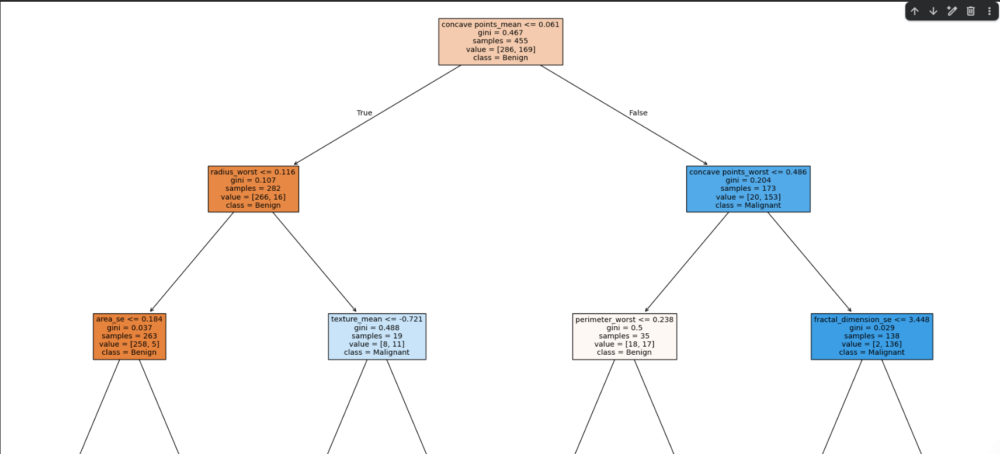
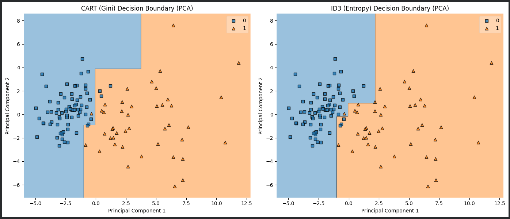
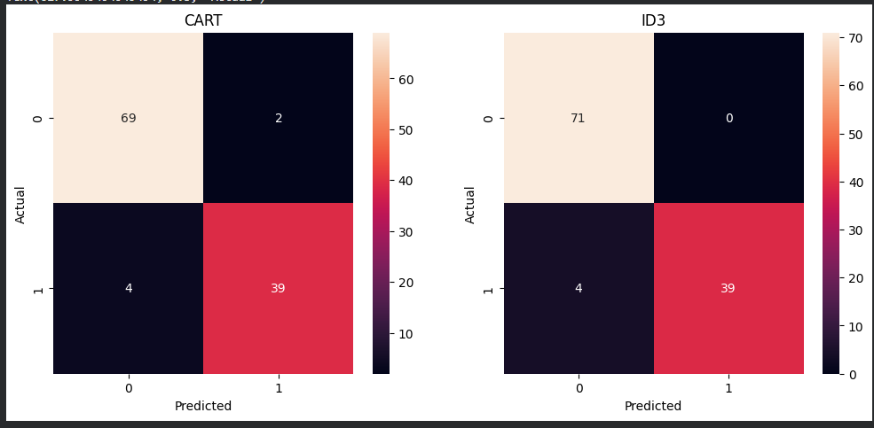
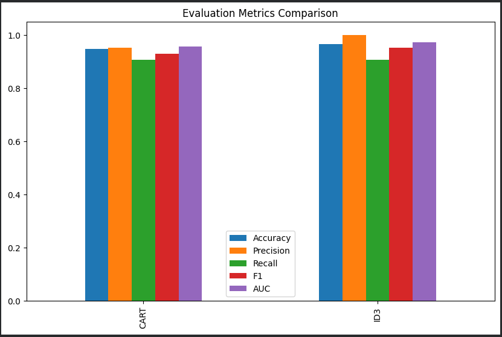
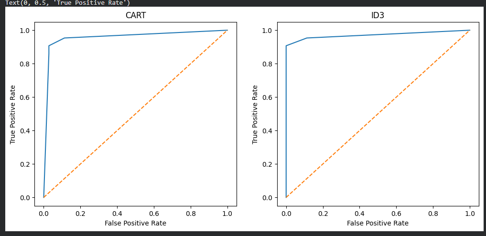

# 🌳 Decision Tree Classification – Medical Diagnosis Project

## 📌 Project Overview
This project applies **Decision Tree Classification** algorithms to classify medical diagnosis data (likely breast cancer classification). Two popular Decision Tree implementations are compared:
- **CART** (Classification and Regression Trees) using **Gini impurity**
- **ID3** (Iterative Dichotomiser 3) using **Entropy**

The models are trained on scaled feature data and optimized using GridSearchCV to find the best hyperparameters. Performance is evaluated on a test set with comprehensive metrics and visualizations.

---

## 📁 Repository Structure
- [210137_dt.ipynb](210137_dt.ipynb) — Full notebook with all steps
- [dataset/data.csv](dataset/data.csv) — Medical diagnosis dataset
- [screenshots/](screenshots/) — Figures and visualizations used in this README

---

## 📂 Dataset Details

### Medical Dataset (data.csv)
- **Source in notebook:** Loaded directly from GitHub raw URL
- **Description:** Medical diagnostic data with multiple features used for classifying patient diagnosis
- **Target Column:** `diagnosis` (binary classification - encoded to 0/1)
- **Features:** 30 numerical features extracted from medical measurements
- **Data Cleaning:**
  - Removes `Unnamed: 32` column if present
  - Excludes `id` and `diagnosis` columns from features
  - Uses `diagnosis_encoded` for classification

---

## 🧪 Notebook Walkthrough (Step-by-Step)

1. **Imports and setup**
  - pandas, numpy, matplotlib, seaborn
  - scikit-learn tools: DecisionTreeClassifier, GridSearchCV, StandardScaler, LabelEncoder
  - mlxtend for decision boundary visualization

2. **Load dataset**
  - Medical dataset loaded from GitHub URL
  - `data.csv` contains diagnostic features and diagnosis labels

3. **Exploratory Data Analysis (EDA)**
  - Dataset shape, sample rows, info, and statistical summary
  - Missing values and duplicate rows check
  - Memory usage and skewness analysis
  - Class distribution visualization (countplot)
  - Correlation heatmap to identify feature relationships

4. **Data Preprocessing**
  - Removes unnecessary columns (`id`, `Unnamed: 32`)
  - LabelEncoder converts `diagnosis` column to binary (0/1)
  - Feature selection: all columns except `id`, `diagnosis`, `diagnosis_encoded`

5. **Feature Scaling**
  - StandardScaler fits on all selected features
  - Normalizes features to have mean=0 and std=1

6. **Train-Test Split**
  - 80% training, 20% testing
  - `random_state=42` for reproducibility

7. **CART Model (Gini Criterion)**
  - GridSearchCV with parameters:
    - `max_depth`: [3, 5, 7, 10, None]
    - `min_samples_split`: [2, 5, 10]
  - 5-fold cross-validation for hyperparameter tuning
  - Best estimator selected and trained

8. **ID3 Model (Entropy Criterion)**
  - GridSearchCV with same parameters as CART
  - Uses `criterion="entropy"` for information gain calculation
  - 5-fold cross-validation for hyperparameter tuning
  - Best estimator selected and trained

9. **Predictions**
  - Both models generate predictions on test set
  - Probability predictions obtained for ROC-AUC calculation

10. **Model Evaluation**
  - Metrics computed for both models:
    - **Accuracy:** Overall correctness
    - **Precision:** Positive prediction accuracy
    - **Recall:** True positive rate
    - **F1-Score:** Harmonic mean of precision and recall
    - **ROC-AUC:** Area under the ROC curve

11. **Decision Boundary Visualization**
  - PCA reduces features to 2D for visualization
  - Separate 2D Decision Tree models trained on PCA features
  - Side-by-side comparison of CART and ID3 decision boundaries

12. **Confusion Matrix**
  - Visual comparison of predictions vs actual values
  - Shows True Positives, False Positives, False Negatives, True Negatives

---

## ✅ Model Comparison Notes
This notebook **compares two Decision Tree algorithms**:
- **CART (Gini):** Minimizes Gini impurity (misclassification rate)
- **ID3 (Entropy):** Maximizes information gain (entropy reduction)

Both models use the **same train/test split** for fair comparison. GridSearchCV automatically selects the best hyperparameters through cross-validation, ensuring optimal performance for each algorithm.

---

## 📊 Key Concepts

### Decision Tree Algorithm
A tree-based model that makes predictions by recursively splitting features into regions that best separate the target classes.

### CART vs ID3
- **CART:** More robust, handles continuous/categorical data, uses Gini impurity
- **ID3:** Simpler, works better with categorical data, uses information gain (entropy)

### Hyperparameter Tuning
- **max_depth:** Controls tree depth (prevents overfitting)
- **min_samples_split:** Minimum samples required to split a node

### PCA for Visualization
Reduces 30 features to 2 principal components for visual decision boundary plots while preserving maximum variance.

---

## � Figures & Visualizations (from screenshots folder)

### Decision Tree Structure
Visual representation of the trained Decision Tree model showing the hierarchical splitting logic and decision nodes.

---

### Decision Boundary Plot
2D visualization comparing CART (Gini) and ID3 (Entropy) decision boundaries on PCA-transformed test data. Shows how each algorithm partitions the feature space differently.

---

### Confusion Matrix
Side-by-side comparison of classification results for both CART and ID3 models:
- **True Positives (TP):** Correctly predicted positive cases
- **True Negatives (TN):** Correctly predicted negative cases
- **False Positives (FP):** Negative cases wrongly predicted as positive
- **False Negatives (FN):** Positive cases wrongly predicted as negative

---

### Evaluation Metrics
Comprehensive performance metrics comparison between CART and ID3:
- **Accuracy:** Overall correctness of predictions
- **Precision:** Reliability of positive predictions
- **Recall:** Coverage of actual positive cases
- **F1-Score:** Balance between precision and recall
- **ROC-AUC:** Area under the ROC curve (higher is better)

---

### ROC Curve
Receiver Operating Characteristic curve showing the trade-off between:
- **True Positive Rate (Sensitivity):** Correctly identified positive cases
- **False Positive Rate:** Incorrectly identified negative cases as positive

Higher AUC score indicates better model discrimination ability.

---

## 📈 Expected Output Summary
- **Metrics comparison:** Accuracy, Precision, Recall, F1, and AUC for both CART and ID3
- **Decision boundary plots:** 2D visualization of classification regions (PCA-reduced)
- **Confusion matrices:** Classification performance breakdown
- **Class distribution:** Imbalance analysis
- **Feature correlations:** Heatmap showing relationships between features
- **Model comparison:** CART vs ID3 performance analysis
