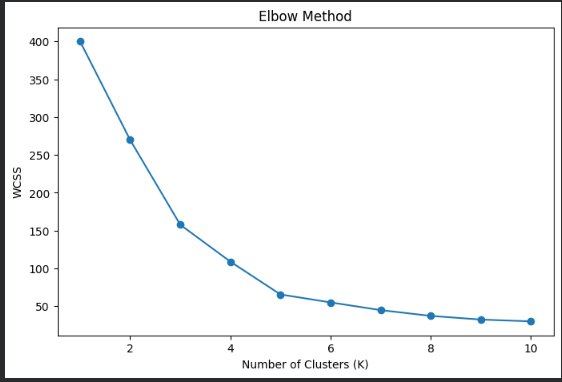
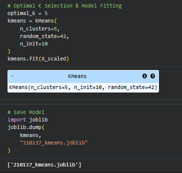
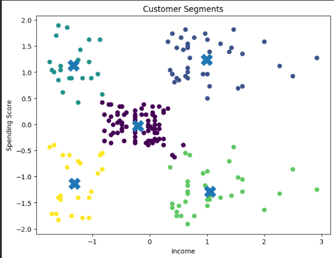
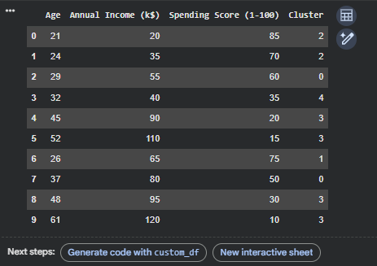

# 🧠 K-Means Clustering – Customer Segmentation Project

## 📌 Project Overview
This project applies **K-Means Clustering** to the **Mall Customers Dataset** to segment customers based on purchasing behavior. The model uses **Annual Income** and **Spending Score** as features and groups customers into meaningful clusters.

The trained model is then used to predict clusters for a **custom dataset of 10 real-world entries** to demonstrate practical usage.

---

## 📁 Repository Structure
- [210137.ipynb](210137.ipynb) — Full notebook with all steps
- [datasets/data.csv](datasets/data.csv) — Mall Customers dataset
- [datasets/custom_data.csv](datasets/custom_data.csv) — Custom survey records
- [model/210137_kmeans.joblib](model/210137_kmeans.joblib) — Trained K-Means model
- [screenshots/](screenshots/) — Figures used in this README

---

## 📂 Dataset Details

### Mall Customers Dataset (data.csv)
- **Source in notebook:** Loaded directly from GitHub raw URL
- **Columns used:**
  - CustomerID
  - Gender
  - Age
  - Annual Income (k$)
  - Spending Score (1-100)
- **Features used for clustering:**
  - Annual Income (k$)
  - Spending Score (1-100)

### Custom Dataset (custom_data.csv)
- **Purpose:** Real-world prediction demo
- **Columns:**
  - Age
  - Annual Income (k$)
  - Spending Score (1-100)

---

## 🧪 Notebook Walkthrough (Step-by-Step)

1. **Imports and setup**
  - pandas, numpy, matplotlib, seaborn
  - scikit-learn tools for scaling and clustering

2. **Load datasets**
  - Mall Customers dataset loaded from GitHub URL
  - Custom dataset loaded from local file in the repo

3. **Exploratory Data Analysis (EDA)**
  - Shape, sample rows, info, summary stats
  - Missing values, duplicates, skewness checks
  - Distribution plots and correlations

4. **Feature selection**
  - Selected `Annual Income (k$)` and `Spending Score (1-100)`

5. **Scaling**
  - StandardScaler is fitted on the selected features
  - All clustering uses the scaled feature space

6. **Elbow Method (Model selection)**
  - WCSS is computed for K = 1 to 10
  - Optimal K chosen as **5**

7. **Model training**
  - KMeans configured with:
    - `n_clusters=5`
    - `n_init=10`
    - `random_state=42`
  - Fitted on the **full scaled dataset**

8. **Model saving**
  - KMeans model saved with Joblib

9. **Cluster visualization**
  - Scatter plot of clusters and centroids

10. **Custom data prediction**
  - Custom dataset scaled using the same scaler
  - Cluster labels predicted and added to the table

11. **Cluster interpretation**
  - Each cluster labeled by income/spending behavior

---

## ✅ Dataset Split and Training Notes
This notebook **does not use a train/test split** because K-Means is an unsupervised clustering method. The model is trained on the **entire dataset** after scaling. The custom dataset is used only for prediction (not for training).

---

## 📊 Figures (from screenshots folder)

### Elbow Method (WCSS vs K)
This is the **training loss-like curve** for K-Means. WCSS decreases as K increases, and the elbow point suggests the best K.



**Figure details:**
- **X-axis:** Number of clusters (K = 1 to 10)
- **Y-axis:** WCSS (within-cluster sum of squares)
- **Purpose:** Identify the elbow point; K=5 is selected

---

### Model Fitting Summary
KMeans fitted with `n_clusters=5`, `n_init=10`, `random_state=42`.



**Figure details:**
- **What it shows:** Fitted KMeans model summary from the notebook
- **Key settings:** `n_clusters=5`, `n_init=10`, `random_state=42`
- **Role:** Confirms model configuration used for training

---

### Cluster Scatter Plot
Customers are grouped into 5 clusters with centroids marked by **X**.



**Figure details:**
- **X-axis:** Scaled `Annual Income (k$)`
- **Y-axis:** Scaled `Spending Score (1-100)`
- **Colors:** Cluster assignments from KMeans
- **Markers:** Centroids shown as `X`

---

### Custom Data Prediction
The custom dataset is scaled, clustered, and assigned a `Cluster` label.



**Figure details:**
- **What it shows:** Output table with predicted cluster labels
- **Columns:** Age, Annual Income, Spending Score, Cluster
- **Usage:** Demonstrates real-world prediction on new records

---

## 🧠 Cluster Interpretation (as in notebook)

- **Cluster 0:** High income + high spending (premium customers)
- **Cluster 1:** High income + low spending (cautious wealthy customers)
- **Cluster 2:** Low income + high spending (impulsive buyers)
- **Cluster 3:** Low income + low spending (budget-conscious customers)
- **Cluster 4:** Average income + average spending (regular customers)

---

## 💾 Joblib Model File Details (Step-by-Step)

1. **Fit scaler on training features**
  - `StandardScaler` is fitted on `Annual Income` and `Spending Score`.

2. **Train KMeans**
  - KMeans is fitted on scaled features (`X_scaled`).

3. **Save model**
  - `joblib.dump(kmeans, "210137_kmeans.joblib")`

4. **Load model later**
  - `kmeans = joblib.load("model/210137_kmeans.joblib")`

5. **Predict on new data**
  - Scale new data using the **same scaler parameters** from training
  - Run `kmeans.predict(new_scaled)`

> Note: The current joblib file stores **only the KMeans model**. To reproduce predictions exactly, also save the fitted scaler (recommended for deployment).

---

## 🧾 Reproducible Code Snippet

```python
import joblib
import pandas as pd
from sklearn.preprocessing import StandardScaler

# Load dataset
df = pd.read_csv("datasets/data.csv")

# Feature selection
X = df[["Annual Income (k$)", "Spending Score (1-100)"]]

# Fit scaler and transform
scaler = StandardScaler()
X_scaled = scaler.fit_transform(X)

# Load trained model
kmeans = joblib.load("model/210137_kmeans.joblib")

# Predict clusters on training data (or new data after scaling)
clusters = kmeans.predict(X_scaled)
```

---

## ✅ Tools & Libraries
- Python
- Google Colab
- Pandas, NumPy
- Matplotlib, Seaborn
- Scikit-learn
- Joblib
