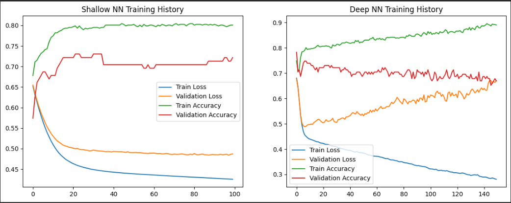
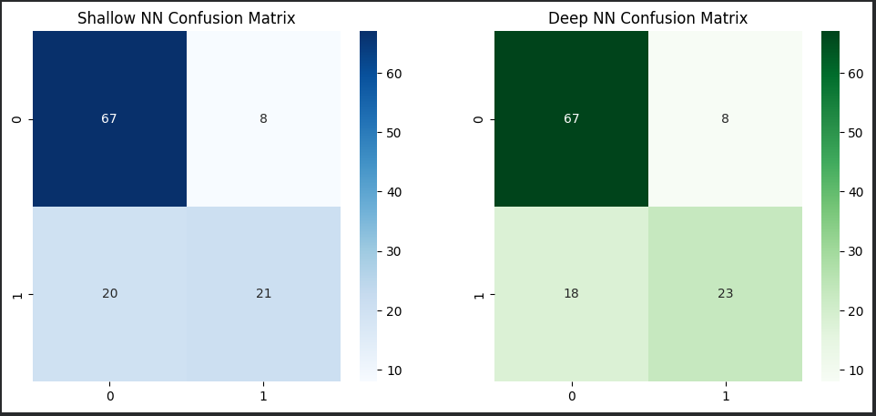
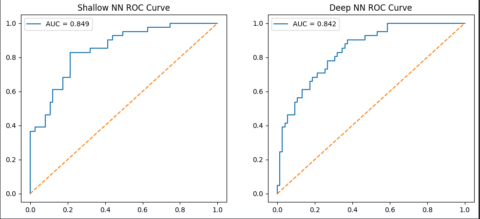
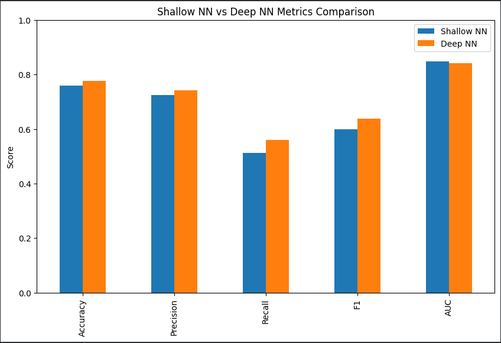
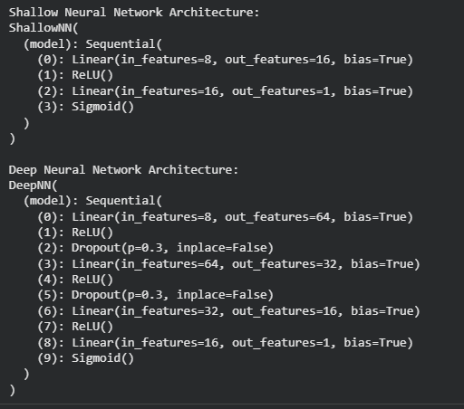
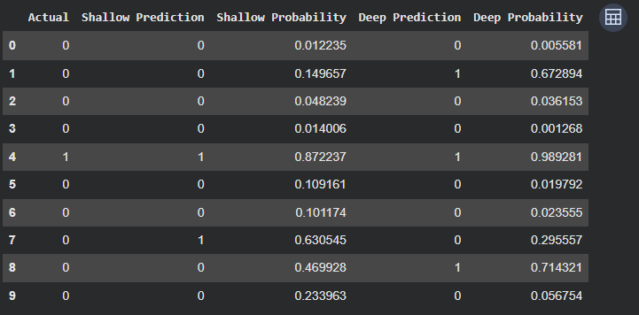

# Diabetes Prediction Using Shallow vs Deep Neural Networks (PyTorch)

## Overview
This project builds and compares two neural-network classifiers for diabetes prediction using the Pima Indians Diabetes dataset:

- Shallow Neural Network (single hidden layer)
- Deep Neural Network (multiple hidden layers with dropout)

The full implementation is provided in the notebook:

- 210137_nn.ipynb

## Objectives
- Perform end-to-end binary classification using neural networks.
- Compare shallow and deep architectures on the same preprocessing pipeline.
- Evaluate both models with standard classification metrics and visual diagnostics.

## Dataset
- Source file: dataset/diabetes.csv
- Target column: Outcome
- Task type: Binary classification (0 = non-diabetic, 1 = diabetic)

### Features used
- Pregnancies
- Glucose
- BloodPressure
- SkinThickness
- Insulin
- BMI
- DiabetesPedigreeFunction
- Age

## Project Workflow
1. Import libraries for data handling, visualization, preprocessing, and PyTorch.
2. Load dataset and inspect shape, statistics, skewness, duplicates, and missing values.
3. Preprocess data:
	 - Median imputation for missing values
	 - Standard scaling for feature normalization
4. Split data into train, validation, and test sets using stratified sampling.
5. Convert arrays to PyTorch tensors and create DataLoader for mini-batch training.
6. Define and train:
	 - ShallowNN: one hidden layer + sigmoid output
	 - DeepNN: three hidden layers + dropout + sigmoid output
7. Evaluate on test data with Accuracy, Precision, Recall, F1, and ROC-AUC.
8. Visualize training behavior, confusion matrix, ROC curve, metrics, and sample predictions.

## Model Architectures

### 1) Shallow Neural Network
- Input layer -> Hidden layer (ReLU/Sigmoid option) -> Output layer (Sigmoid)
- Lower complexity, faster training, easier interpretation

### 2) Deep Neural Network
- Input -> 64 -> 32 -> 16 -> Output
- ReLU activations + dropout regularization
- Better representation power for complex feature interactions

## Training Configuration
- Loss function: Binary Cross Entropy (BCELoss)
- Optimizer: Adam
- Learning rate: 0.001
- Epochs:
	- Shallow model: 100
	- Deep model: 150

## Evaluation Metrics
Both models are evaluated on:
- Accuracy
- Precision
- Recall
- F1-score
- ROC-AUC

## Screenshot-Based Results and Interpretation

### 1) Training History

This plot compares train/validation loss and accuracy for both models across epochs. It helps verify convergence and whether a model is overfitting or generalizing well.

### 2) Confusion Matrix

The confusion matrices show true positives, true negatives, false positives, and false negatives for shallow and deep models. This gives class-wise error insight beyond overall accuracy.

### 3) ROC Curve

The ROC curves visualize the true positive vs false positive trade-off at different thresholds. A larger AUC indicates stronger ranking and discrimination ability.

### 4) Metrics Comparison

This bar chart compares Accuracy, Precision, Recall, F1, and AUC side-by-side for both models, making overall performance differences easy to interpret.

### 5) Network Structure

This output prints the architecture definitions for both neural networks, confirming layer depth, hidden units, dropout usage, and output setup.

### 6) Sample Prediction Table

The sample table displays actual labels, predicted labels, and class probabilities, which helps inspect confidence and error patterns on individual examples.

## Key Takeaways
- The shallow model provides a strong baseline with simpler structure.
- The deep model can capture richer non-linear patterns and may improve AUC/F1 when tuned properly.
- Best model selection should be based on validation/test behavior and not depth alone.

## Reproducibility Notes
- Ensure required Python libraries are installed:
	- pandas, numpy, matplotlib, seaborn
	- torch
	- scikit-learn
- Run all notebook cells in order for consistent preprocessing, training, and evaluation outputs.

## Folder Structure
NN/
- 210137_nn.ipynb
- readme.md
- dataset/
	- diabetes.csv
- screenshots/
	- training-history.png
	- confusion-matrix.png
	- roc-curve.png
	- metrics-comparison.png
	- network-structure.png
	- sample-prediction-table.png
